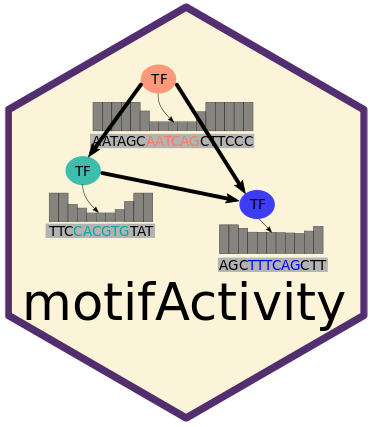

<a name="logo"/>
<div align="center">
</img>
</a>
</div>

# motifActivity: an R package for reconstruction of transcription factor networks from high-throughput data and sequence information

The **motifActivity** R package predicts key transcription factors (TFs) driving gene expression or epigenetic marks changes across the input samples, and the activity profiles of TFs. As input is uses a set of gene expression (e.g. RNA-seq) or epigenetic marks (such as from BS-seq, ChIP-seq, ATAC-seq etc.) across samples, and a set of DNA motifs.


# Installation

### Install the latest version via install_github

You can install the development version of **motifActivity** directly from Github:

``` r
library(devtools)
install_github("BIMSBbioinfo/motifActivity",build_vignettes=FALSE)
```
